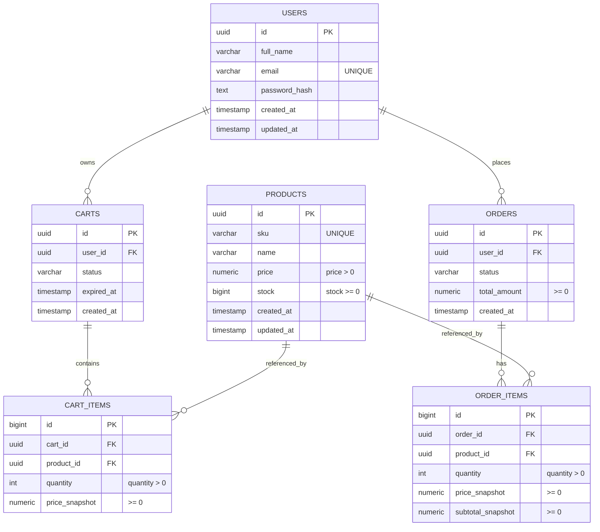
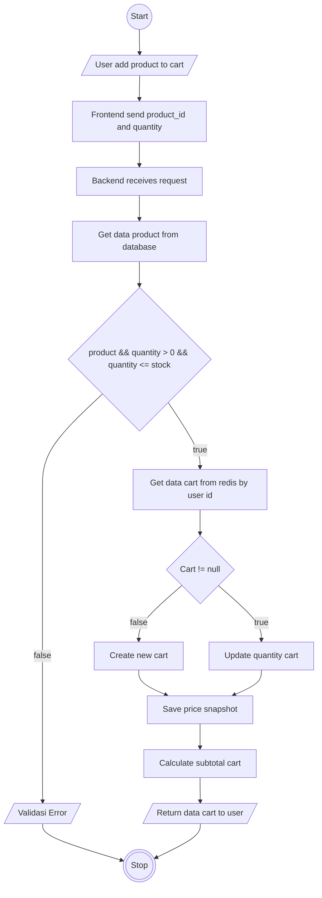
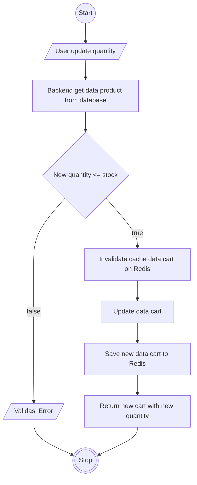
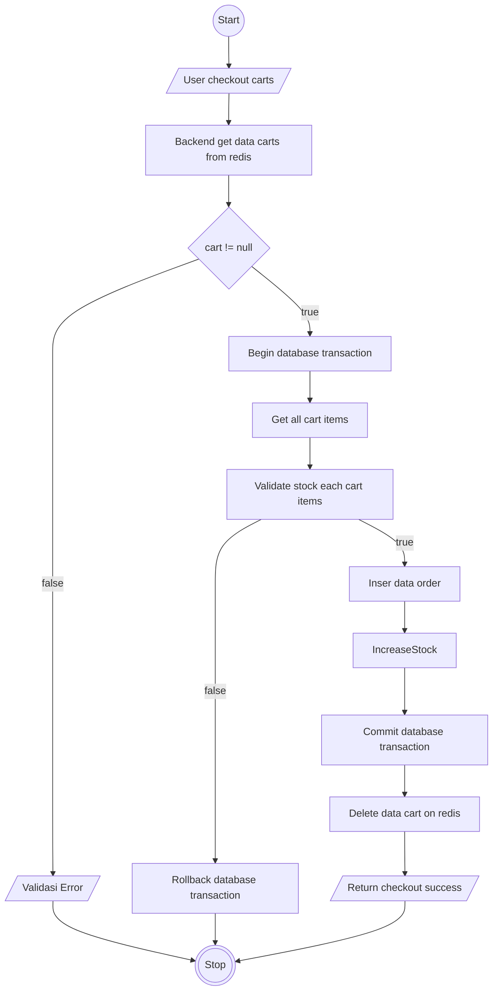

# System Design Cart System

## ERD

```mermaid
erDiagram
    USERS {
        uuid id PK
        varchar full_name
        varchar email "UNIQUE"
        text password_hash
        timestamp created_at
        timestamp updated_at
    }

    PRODUCTS {
        uuid id PK
        varchar sku "UNIQUE"
        varchar name
        numeric price "price > 0"
        bigint stock "stock >= 0"
        timestamp created_at
        timestamp updated_at
    }

    CARTS {
        uuid id PK
        uuid user_id FK
        varchar status
        timestamp expired_at
        timestamp created_at
    }

    CART_ITEMS {
        bigint id PK
        uuid cart_id FK
        uuid product_id FK
        int quantity "quantity > 0"
        numeric price_snapshot ">= 0"
    }

    ORDERS {
        uuid id PK
        uuid user_id FK
        varchar status
        numeric total_amount ">= 0"
        timestamp created_at
    }

    ORDER_ITEMS {
        bigint id PK
        uuid order_id FK
        uuid product_id FK
        int quantity "quantity > 0"
        numeric price_snapshot ">= 0"
        numeric subtotal_snapshot ">= 0"
    }

    USERS ||--o{ CARTS : owns
    CARTS ||--o{ CART_ITEMS : contains
    PRODUCTS ||--o{ CART_ITEMS : referenced_by

    USERS ||--o{ ORDERS : places
    ORDERS ||--o{ ORDER_ITEMS : has
    PRODUCTS ||--o{ ORDER_ITEMS : referenced_by
```

# Flowchart

## Add Item

```mermaid
flowchart TD
    Start@{ shape: circle, label: "Start" }
    Stop@{ shape: dbl-circ, label: "Stop" }

    Add@{ shape: lean-r, label: "User add product to cart" }
    Send@{ shape: rect, label: "Frontend send product_id and quantity" }

    Receive@{ shape: rect, label: "Backend receives request" }
    Get@{ shape: rect, label: "Get data product from database" }

    Check@{ shape: diamond, label: "product && quantity > 0 && quantity <= stock" }

    Error@{ shape: lean-r, label: "Validasi Error" }
    GetDataFromRedis@{ shape: rect, label: "Get data cart from redis by user id" }

    CheckCart@{ shape: diamond, label: "Cart != null" }

    CreateNewCart@{ shape: rect, label: "Create new cart" }
    UpdateQtyCart@{ shape: rect, label: "Update quantity cart" }

    SavePriceSnapshot@{ shape: rect, label: "Save price snapshot" }
    CalculateTotal@{ shape: rect, label: "Calculate subtotal cart" }

    ReturnCart@{ shape: lean-r, label: "Return data cart to user" }

    Start --> Add --> Send--> Receive --> Get --> Check

    Check-- false --> Error --> Stop
    Check-- true --> GetDataFromRedis --> CheckCart

    CheckCart -- false --> CreateNewCart --> SavePriceSnapshot
    CheckCart -- true --> UpdateQtyCart --> SavePriceSnapshot

    SavePriceSnapshot --> CalculateTotal --> ReturnCart --> Stop

```

## Update Quantity

```mermaid
flowchart TD
    Start@{ shape: circle, label: "Start" }
    Stop@{ shape: dbl-circ, label: "Stop" }

    UserUpdate@{ shape: lean-r, label: "User update quantity" }
    BackendGet@{ shape: rect, label: "Backend get data product from database" }

    CheckStock@{ shape: diamond, label: "New quantity <= stock" }
    ReturnError@{ shape: lean-r, label: "Validasi Error" }
    InvalidateRedis@{ shape: rect, label: "Invalidate cache data cart on Redis" }
    UpdateCart@{ shape: rect, label: "Update data cart" }
    SaveToRedis@{ shape: rect, label: "Save new data cart to Redis" }
    ReturnNewCart@{ shape: rect, label: "Return new cart with new quantity" }

    Start --> UserUpdate --> BackendGet --> CheckStock

    CheckStock -- false --> ReturnError --> Stop
    CheckStock -- true --> InvalidateRedis --> UpdateCart --> SaveToRedis --> ReturnNewCart --> Stop
```

## Checkout

```mermaid
flowchart TD
    Start@{ shape: circle, label: "Start" }
    Stop@{ shape: dbl-circ, label: "Stop" }

    UserCheckout@{ shape: lean-r, label: "User checkout carts" }
    BackendGet@{ shape: rect, label: "Backend get data carts from redis" }

    CheckCart@{ shape: diamond, label: "cart != null" }
    ReturnError@{ shape: lean-r, label: "Validasi Error" }
    BeginTransaction@{ shape: rect, label: "Begin database transaction" }
    GetAllCart@{ shape: rect, label: "Get all cart items" }
    CheckStock@{ shape: rect, label: "Validate stock each cart items" }

    Rollback@{ shape: rect, label: "Rollback database transaction" }
    InsertOrder@{ shape: rect, label: "Inser data order" }
    Commit@{ shape: rect, label: "Commit database transaction"}
    DeleteRedis@{ shape: rect, label: "Delete data cart on redis" }
    ReturnSuccess@{ shape: lean-r, label: "Return checkout success" }

    Start --> UserCheckout --> BackendGet --> CheckCart

    CheckCart -- false --> ReturnError --> Stop
    CheckCart -- true --> BeginTransaction --> GetAllCart --> CheckStock

    CheckStock -- false --> Rollback --> Stop
    CheckStock -- true --> InsertOrder --> IncreaseStock --> Commit --> DeleteRedis --> ReturnSuccess --> Stop
```
