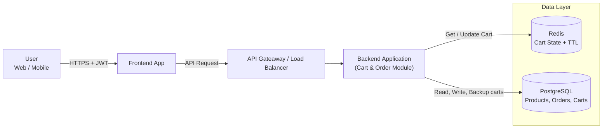
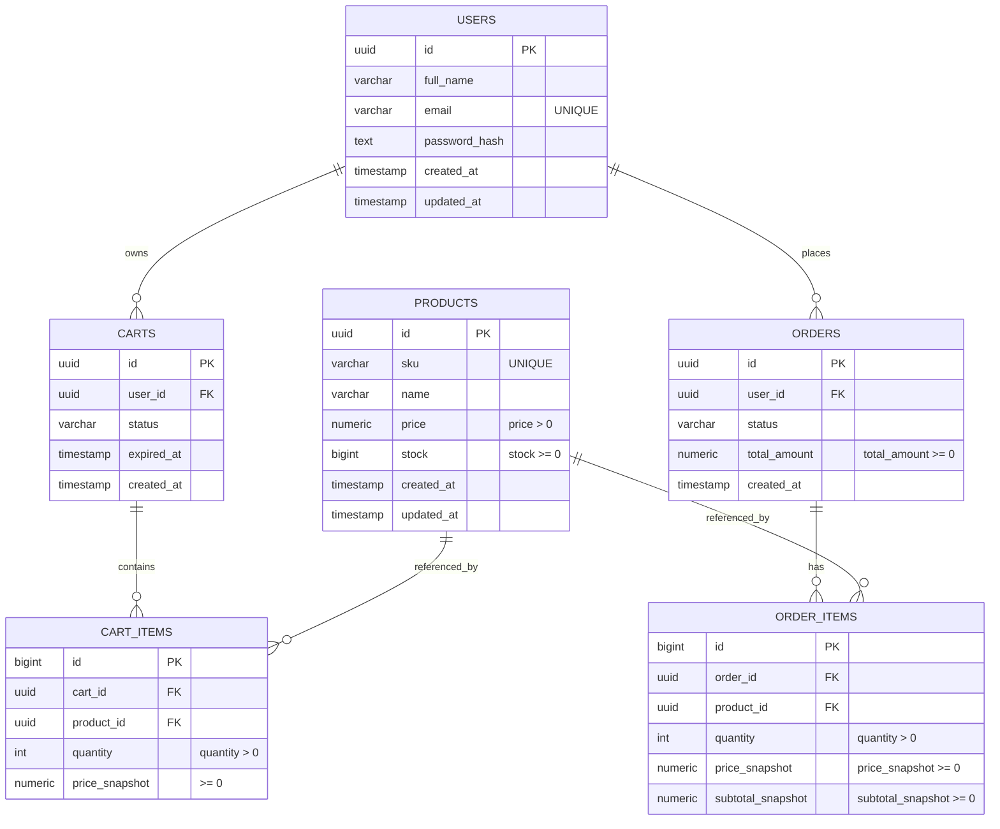
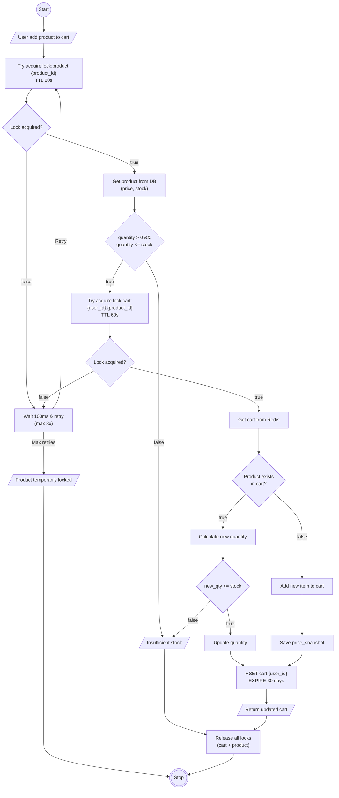
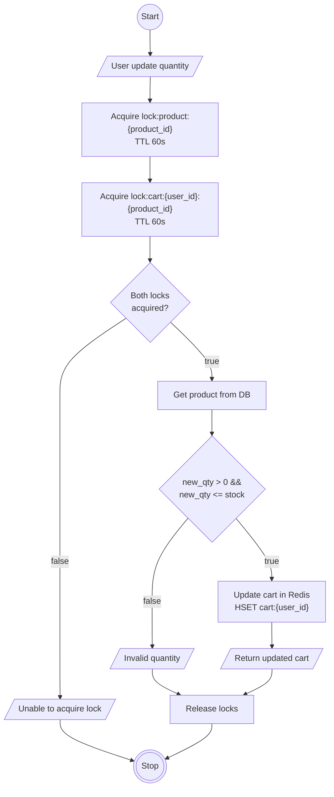
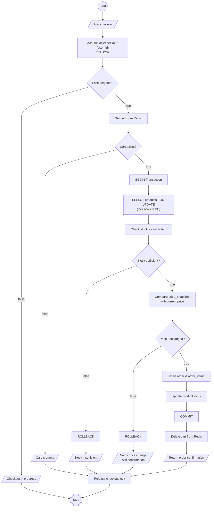
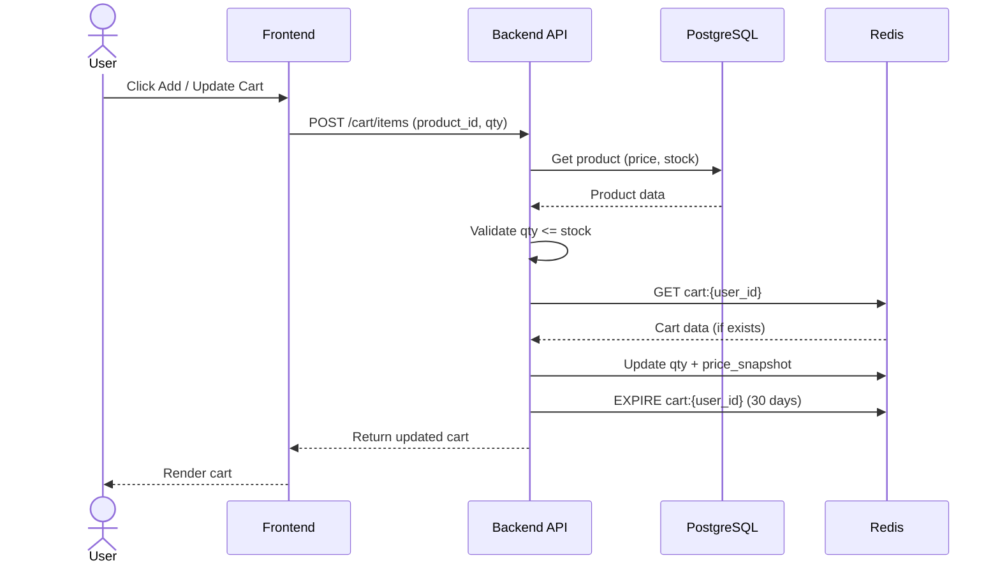
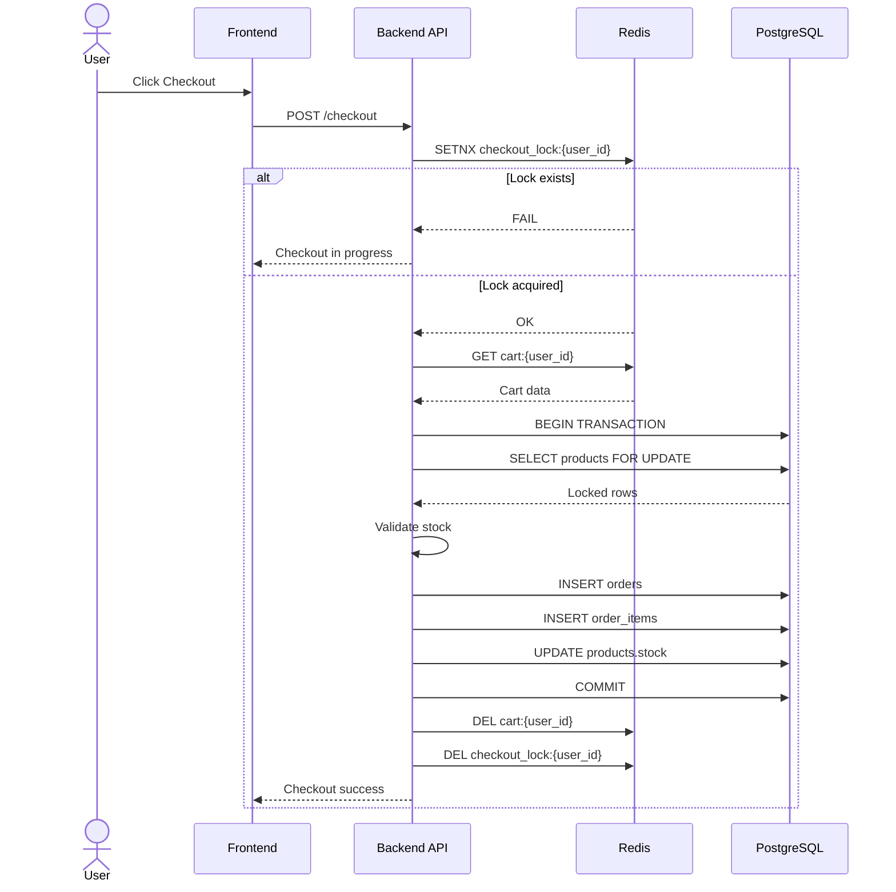
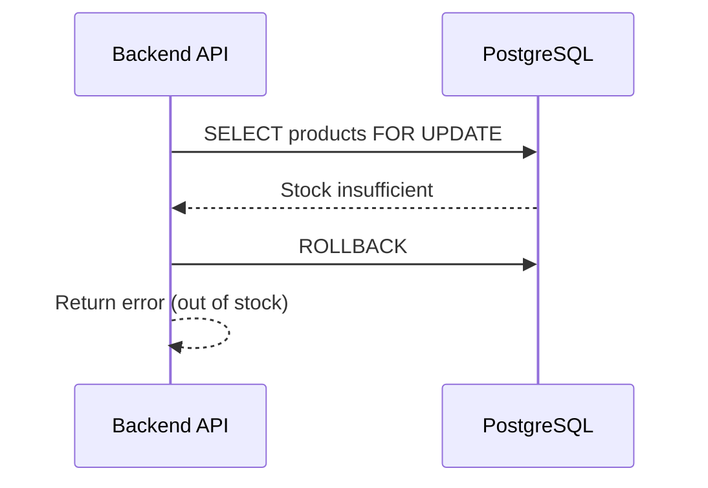

# System Design Cart System

## Requirements

- Add prouduct to cart
- Remove product from cart
- Update quantity
- Remove cart/Checkout
- Consistent/Multi device (accross sessions) per account
- Race condition (only 1 cart can be checkout)
- 1 day 1 million data add to cart
- Expired cart 1 month
- Data integrity (no price manipulation, and parameter tampering)
- Validation stock when checkout

## Storage Type Selection Strategy

1. Redis

   - To store active cart data
   - Automatic expiration (TTL)
   - Fast and inexpensive (suitable for frequently changing data, such as carts)

Redis key structue:

```
# Cart data
cart:{user_id} → Hash of cart items
  - TTL: 30 days
  - Value: {"product_id": {"qty": 2, "price_snapshot": 15000, "added_at": timestamp}}

# Locks
lock:cart:{user_id}:{product_id} → "locked"
  - TTL: 60 seconds
  - Value: timestamp of lock creation

lock:product:{product_id} → "locked"
  - TTL: 60 seconds
  - Used during add/update to prevent overselling

lock:checkout:{user_id} → "locked"
  - TTL: 120 seconds
  - Longer TTL for checkout process
```

2. PostgreSQL
   - Stores product data (name, price, stock, etc.)
   - Order data after checkout
   - PostgreSQL is an RDBMS that can maintain data consistency and data integrity.

## Architecture Diagram



## ERD



# Flowchart

## Add Item



## Update Quantity



## Checkout



# Sequence Diagram

## Add and Update Cart



## Checkout



## Checkout (Failed)


